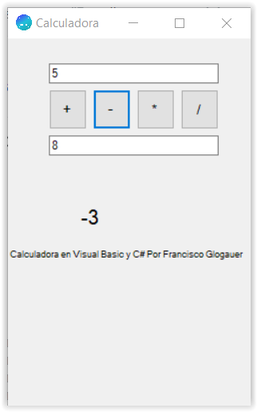

# C# Calc

C calc es una calculadora hecha en C# y Visual basic

# Ventajas:
- Poco Consumo
- Rapidez al calcular
- (proximamente) código abierto para Visual Studio
- Infinutos Decimales

# Desventajas
- Calculadora Simple
- Interfáz simple

# Capturas de pantalla

